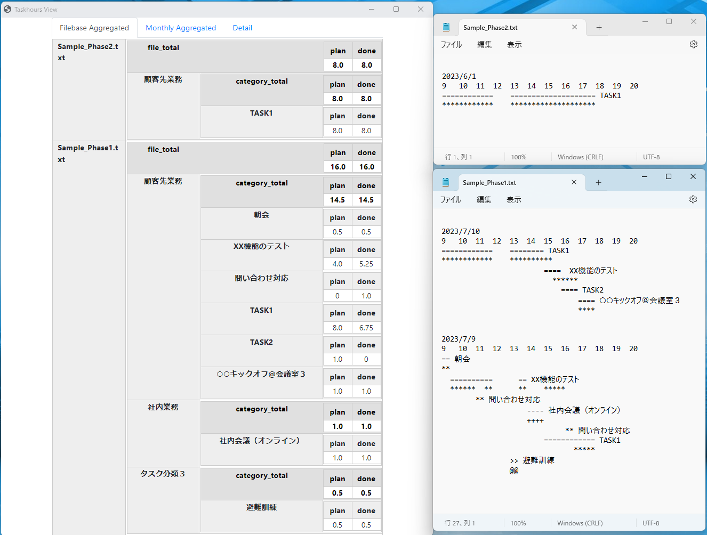

# Textbased Taskhour View

テキスト形式で入力された予定・実績時間をHTML表示するシンプルなツールです。



## 特徴

- カテゴリー、ファイルベース、日次、月次によるタスク時間の集計します。
- 集計データをHTML形式で出力・表示します。
- テキストが変更されると、集計データをリアルタイムに更新し表示します。

## EXEでの実行（Windows）

"Code -> Download ZIP"からこのプロジェクトをダウンロードし、解凍します。

エクスプローラでアプリディレクトリに移動し、"TaskhourView.exe" ファイルをダブルクリックします。


## Pythonでの実行

### 必要なもの

- [Git](https://git-scm.com/)
- [Python 3.11](https://www.python.org/downloads/)
- [pip](https://pip.pypa.io/en/stable/installation/)

### インストール

プロジェクトをクローンします：

```bash
git clone https://github.com/daiwata/textbased-tasktime-view.git
```

プロジェクトのディレクトリに移動します：

```bash
cd textbased-taskhours-viewer
```

仮想環境を作成し、それを有効化します：

```bash
python -m venv venv
source venv/bin/activate
```

必要なパッケージをインストールします：

```bash
pip install -r requirements.txt
```

### アプリケーションの実行

srcディレクトリに移動してmain.pyファイルを実行します：

```bash
cd src
python main.py
```

## テキストファイルの編集方法

input ディレクトリにテキストファイルを用意します。

### 例1）

以下は、2023/6/1 に、タスク1の実績が1時間だったことを表します。

example1.txt

```txt
2023/6/1

 **** タスク１
```

- `*` 一つを実働15分（0.25時間）として数えます。
- 記号を複数記載し、その後に半角スペースを空けてタスク名を記載します。

### 例2）

以下は、2023/6/1 に、タスク1の予定が1時間、実績が1時間だったことを表します。

example1.txt

```txt
2023/6/1

 ==== タスク１
 ****

```

- `=` 一つを予定15分（0.25時間）として数えます。
- `=` の次の行の `*` については、タスク名の記載を省略できます。

### 例3）

以下は、2023/6/1 に、タスク1の予実が1時間、タスク2の予定が0.5時間、実績が0時間だったことを表します。


```txt
2023/6/1

 ===  = タスク１
  ***  *
    == タスク2
```

- 複数のタスクを上記のように記載できます。
- 記号は、行内で半角スペースを空けて連続できます。  
  （ただし他の文字列が入ると、そのほかの文字列はタスク名として集計します）


### 例4）

複数の日付の記載する場合は以下のようにします。

```txt
2023/6/2

 === タスク２
 *****

2023/6/1

 ===  = タスク１
  ***  *
    == タスク2
     ** **
```

- この場合、月単位の集計・ファイル単位の集計においては、タスク2は、予定1.25時間、実績2.25時間となります。


### 例5）

目盛りをつけておくと予定が立てやすいし、いつ何をしたのかが明確になります。

```txt
2023/6/2
9   10  11  12  13  14  15  16  17  18  19

============    =============== タスク1
************    ***************
                               ===== タスク2
```


### 例6）

予定と実績にはカテゴリが設定できます。  
app/setting.json で編集できます。

```json
[
    { 
        "type": "顧客先業務", 
        "sepPlan": "=", 
        "sepDone": "*"
    },
    { 
        "type": "社内業務", 
        "sepPlan": "-", 
        "sepDone": "+"
    },
    { 
        "type": "タスク分類３", 
        "sepPlan": ">", 
        "sepDone": "@"
    }
```

たとえば、以下の場合は社内業務として予実が1時間です。

```txt
2023/6/2
9   10  11  12  13  14  15  16  17  18  19
---- 社内オンライン会議
++++
```

### 例7）

複数のテキストファイルを設置できます。  
業務のフェーズ単位なでファイルを分けると管理しやすいです。

- [サンプルファイル1](app/input/Sample_Phase1.txt)
- [サンプルファイル2](app/input/Sample_Phase2.txt)


## Windows用にEXEファイルを作成

追加のパッケージをインストールします：

```bash
pip install pyinstaller
pip install git+https://github.com/bottlepy/bottle.git
```

appディレクトリに移動してアプリケーションをコンパイルします：

```bash
cd app
pyinstaller -wF --add-data="web/*;web/" main.py --clean --distpath . -n TaskhoursView.exe
```

## コントリビューション

プルリクエストは大歓迎です。大きな変更の場合は、まず問題を開いて変更したい内容について議論してください。

## ライセンス

このプロジェクトはMITライセンスの下でライセンスされています。詳細については、LICENSE.txtファイルをご覧ください。
